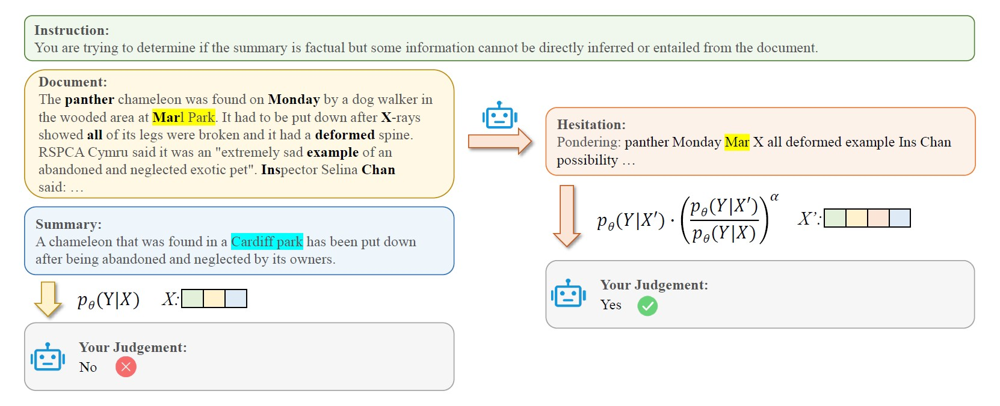

**S**elf-**H**ighlighted **H**esitation (SH2)

===
Code for the paper [SH2: Self-Highlighted Hesitation Helps You Decode More Truthfully](https://arxiv.org/abs/2401.05930)

## Environment setup

```
pip install -e transformers
pip install datasets
pip install accelerate
pip install openai # -> only for truthfulqa and gpt4_eval
```

## Example experiments
```
cd experiments # running scripts
```

- **SH2**
```
bash factor_keys.sh # prepare key tokens
bash factor_hard.sh
```

- Baseline: LLaMA_7B, LLaMA2_7B or Mistral-7B-v0.1
```
bash factor_baseline.sh
```

- DoLa (Repo: https://github.com/voidism/DoLa)
```
bash factor_dola.sh
```

## Citation
If you find this work helpful, please cite our paper:
```
@article{kai2024sh2,
  title={SH2: Self-Highlighted Hesitation Helps You Decode More Truthfully},
  author={Kai, Jushi and Zhang, Tianhang and Hu, Hai and Lin, Zhouhan},
  journal={arXiv preprint arXiv:2401.05930},
  year={2024}
}
```
